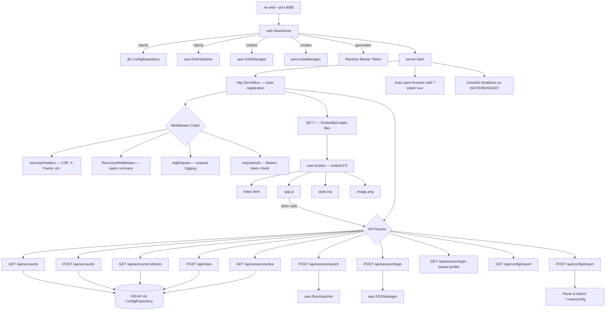
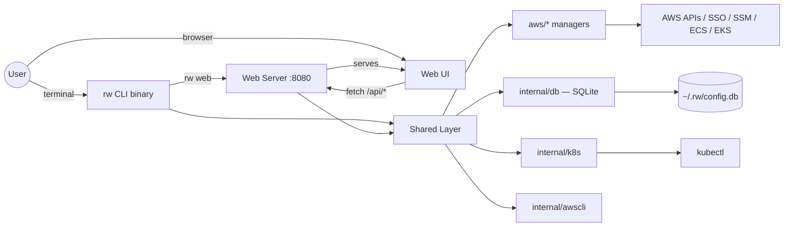

# Architecture Flow

## CLI Flow

```mermaid
flowchart TD
    A[main.go] --> B[cli.RunCLI]
    B --> C[NewCLI]
    C --> C1[ConfigManager]
    C --> C2[SSOManager]
    C --> C3[ProfileSwitcher]
    C --> C4[KubeManager]
    C --> C5[TunnelManager]
    C --> C6[SSMManager]
    C --> C7[DatabaseManager]
    C --> C8[RedisManager]
    C --> C9[MSKManager]
    C --> C10[ScalingManager]
    C --> C11[ReplicationManager]
    C --> C12[MaintenanceManager]
    C --> C13[GRPCManager]
    C --> DB1[db.NewDB + ConfigRepository]
    C --> CS[ConfigSync — auto-imports ~/.aws/config on first run]

    B --> D[cli.Run — command router]

    D --> |list / ls| E1[listProfiles]
    D --> |switch / use| E2[switchProfile]
    D --> |login| E3[login via SSOManager]
    D --> |logout| E4[logout]
    D --> |status| E5[status — show active session]
    D --> |current| E6[current — show current profile]
    D --> |context / ctx| E7[context — manage AWS contexts]
    D --> |kube / k8s| E8[kube — namespace + context mgmt]
    D --> |db| E9[db — connect / backup / restore]
    D --> |tunnel| E10[tunnel — start / stop SSM tunnels]
    D --> |port| E11[port — port forwarding]
    D --> |grpc| E12[grpc — gRPC connections]
    D --> |redis| E13[redis — Redis connect]
    D --> |msk| E14[msk — Kafka UI / stop]
    D --> |maintenance| E15[maintenance — status / toggle]
    D --> |scale| E16[scale — ECS/EKS scaling]
    D --> |replication| E17[replication — status / switch / create / delete]
    D --> |ssm| E18[ssm — get / list parameters]
    D --> |config / cfg| E19[config — status / sync / generate / delete]
    D --> |set| E20[set — prompt customisation]
    D --> |web| E21[web — launch web UI]

    E2 --> AWS1[aws.ProfileSwitcher]
    E3 --> AWS2[aws.SSOManager]
    E8 --> AWS3[aws.KubeManager]
    E10 --> AWS4[aws.TunnelManager]
    E16 --> AWS5[aws.ScalingManager]
    E19 --> AWS6[aws.ConfigSync]
```

## Web Flow

```mermaid
flowchart TD
    CLI[rw web --port 8080] --> NS[web.NewServer]
    NS --> |injects| DEP1[db.ConfigRepository]
    NS --> |injects| DEP2[aws.RoleSwitcher]
    NS --> |creates| DEP3[aws.SSOManager]
    NS --> |creates| DEP4[aws.KubeManager]
    NS --> |generates| TOK[Random Bearer Token]

    NS --> START[server.Start]
    START --> MUX[http.ServeMux — route registration]
    START --> BROWSER[Auto-open browser with ?token=xxx]

    MUX --> MW{Middleware Chain}
    MW --> MW1[securityHeaders — CSP, X-Frame, etc.]
    MW --> MW2[RecoveryMiddleware — panic recovery]
    MW --> MW3[logRequest — request logging]
    MW --> MW4[requireAuth — Bearer token check]

    MUX --> STATIC[GET / — Embedded static files]
    STATIC --> EMB[web.Assets — embed.FS]
    EMB --> F1[index.html]
    EMB --> F2[app.js]
    EMB --> F3[style.css]
    EMB --> F4[image.png]

    MUX --> API{API Routes}
    API --> R1[GET /api/accounts]
    API --> R2[POST /api/accounts]
    API --> R3[GET /api/accounts/:id/roles]
    API --> R4[POST /api/roles]
    API --> R5[GET /api/session/active]
    API --> R6[POST /api/session/switch]
    API --> R7[POST /api/session/login]
    API --> R8[GET /api/session/login-status/:profile]
    API --> R9[GET /api/config/import]
    API --> R10[POST /api/config/import]

    F2 --> |fetch calls| API

    R1 --> DB[(SQLite via ConfigRepository)]
    R2 --> DB
    R3 --> DB
    R4 --> DB
    R5 --> DB
    R6 --> RS[aws.RoleSwitcher]
    R7 --> SSO[aws.SSOManager]
    R10 --> IMPORT[Parse & import ~/.aws/config]

    START --> SHUT[Graceful shutdown on SIGTERM/SIGINT]
```

## How They Connect

```mermaid
flowchart LR
    USER((User)) --> |terminal| CLI_BIN[rw CLI binary]
    USER --> |browser| WEB_UI[Web UI]

    CLI_BIN --> |rw web| WEB_SERVER[Web Server :8080]
    WEB_SERVER --> |serves| WEB_UI
    WEB_UI --> |fetch /api/*| WEB_SERVER

    CLI_BIN --> SHARED[Shared Layer]
    WEB_SERVER --> SHARED

    SHARED --> AWS_PKG[aws/* managers]
    SHARED --> DB_PKG[internal/db — SQLite]
    SHARED --> K8S_PKG[internal/k8s]
    SHARED --> AWSCLI[internal/awscli]

    AWS_PKG --> AWSAPI[AWS APIs / SSO / SSM / ECS / EKS]
    K8S_PKG --> KUBECTL[kubectl]
    DB_PKG --> SQLITE[(~/.rw/config.db)]
```
